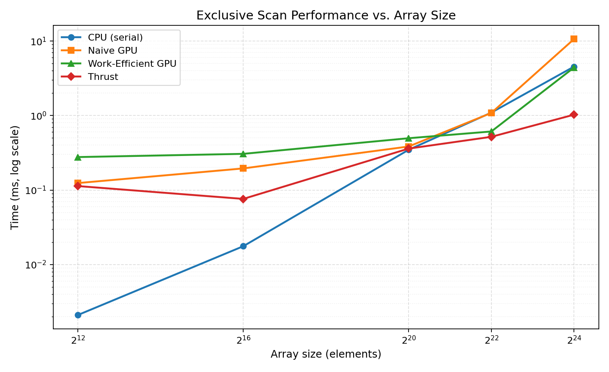

CUDA Stream Compaction
======================

**University of Pennsylvania, CIS 5650: GPU Programming and Architecture, Project 2**

* Xuan Zhu
  * [LinkedIn](https://www.linkedin.com/in/xuan-zhu-4ba736220)
* Tested on: Windows 11, AMD Ryzen AI 7 350, 32GB DDR5, NVIDIA GeForce RTX 5070 Laptop GPU (Personal computer)
* Built with CUDA 13.3, Visual Studio 2022, Release configuration, run without the debugger attached.

## Overview

This project implements exclusive prefix sum (scan) and stream compaction on both the CPU and the GPU, and uses the scan as a building block for a GPU radix sort. The point of the exercise is to compare implementations that differ in asymptotic work, memory traffic, and kernel launch count, and to see which of those actually determines runtime on real hardware.

### Features

* Serial CPU exclusive scan
* CPU stream compaction without scan (single write pointer)
* CPU stream compaction via map, scan, and scatter
* Naive GPU scan, `O(N log N)` work, ping-pong buffers
* Work-efficient GPU scan, `O(N)` work, up-sweep and down-sweep over a balanced tree
* Work-efficient GPU stream compaction
* Thrust `exclusive_scan` as a library baseline
* Thread-compacted launch configuration for the work-efficient scan (extra credit)
* GPU radix sort for non-negative integers, built on the work-efficient scan (extra credit)
* Shared-memory scan with per-block scanning, recursive block-sum scan, and bank-conflict padding (extra credit)
* Power-of-two and non-power-of-two input support throughout

Everything lives in the `stream_compaction` subproject so it can be lifted into the path tracer later.

## Implementation Notes

**CPU scan** is a single accumulating loop. Since `compactWithScan` needs a scan internally and the timer cannot be started twice, the loop is factored into a timer-free `scanImpl` that both entry points call.

**Naive GPU scan** launches one kernel per doubling offset, `ilog2ceil(n)` in total, because threads cannot be synchronized across blocks. Two device buffers are swapped each level so no thread reads a location another thread is writing. The result is an inclusive scan, so the copy back to the host shifts right by one and writes a zero into element 0.

**Work-efficient GPU scan** pads the working array up to the next power of two and zeroes the padding. Up-sweep reduces into the right child of each node, the root is then cleared (this is what makes the result exclusive), and down-sweep pushes prefixes back down. It runs in place, since no thread reads a location another thread writes within a level.

**Stream compaction** maps to booleans, scans them for destination indices, and scatters. The element count is `indices[n-1] + bools[n-1]`, since an exclusive scan omits the last element; the boolean array is kept separate from the scan buffer because the scan runs in place and would otherwise destroy the flags before the count is read.

**Thrust scan** wraps `thrust::exclusive_scan`, with `device_vector` construction and the copy back outside the timer.

## Performance Analysis

All numbers below come from Release builds run without the debugger. GPU timings use CUDA events and exclude `cudaMalloc` and the initial and final `cudaMemcpy`; CPU timings use `std::chrono`.

A word on measurement noise, because it affects how the rest of this section should be read. Repeating the same binary on the same input produced run-to-run spreads of up to 30% for both the CPU and the GPU scans. For example, the work-efficient scan at `N = 2^20` with a block size of 256 measured 0.475 ms on one run and 0.635 ms on the next. Differences smaller than roughly 0.15 ms at this input size are therefore not meaningful, and I have tried not to draw conclusions from them.

### Block Size

Block size was swept across five values at `N = 2^20`, with the same value applied to the naive scan, the work-efficient scan, and radix sort. Where two numbers appear, they are two separate runs of the same binary.

| Block size | Naive scan (ms) | Work-efficient scan (ms) |
| ---------- | --------------- | ------------------------ |
| 32         | 0.779           | 0.441                    |
| 64         | 0.460           | 0.548                    |
| 128        | 0.384 / 0.344   | 0.496 / 0.504            |
| 256        | 0.408 / 0.387   | 0.475 / 0.635            |
| 512        | 0.357 / 0.329   | 0.475 / 0.565            |

The naive scan shows one effect that is clearly larger than the noise: a block size of 32 is about twice as slow as anything else. At 32 threads a block is a single warp, so an SM has far fewer resident warps available to switch to while a memory request is outstanding. Since every thread in this kernel does one global load, one add, and one global store, there is nothing to hide the latency behind, and throughput drops. From 64 upward the naive scan varies by less than the run-to-run spread, so I do not read a ranking into those four columns.

The work-efficient scan shows no trend at all across the whole sweep. Every value falls between 0.44 and 0.64 ms, which is narrower than the spread I measured by re-running a single configuration. This is itself informative: occupancy is not what limits this kernel, so changing the block size does not move it.

**Block size 128 was used for all remaining measurements.** It is among the fastest for the naive scan and indistinguishable from the rest for the work-efficient scan.

### Scan vs. Array Size



All four implementations, block size 128, power-of-two inputs. Both axes are logarithmic.

| N        | CPU (ms) | Naive (ms) | Work-efficient (ms) | Thrust (ms) |
| -------- | -------- | ---------- | ------------------- | ----------- |
| 2^12     | 0.0021   | 0.124      | 0.277               | 0.113       |
| 2^16     | 0.0176   | 0.195      | 0.306               | 0.076       |
| 2^20     | 0.347    | 0.384      | 0.496               | 0.360       |
| 2^22     | 1.096    | 1.084      | 0.611               | 0.518       |
| 2^24     | 4.541    | 10.639     | 4.413               | 1.027       |

Four things stand out.

**The CPU wins until roughly 2^22.** At 2^12 it is more than fifty times faster than any GPU version. The GPU curves are nearly flat from 2^12 to 2^16 despite a sixteen-fold larger input, which means the GPU is not doing meaningful work in that range at all: the time is kernel launch and synchronization overhead.

**The naive scan collapses at 2^24**, going from parity with the CPU at 2^22 to 2.3x slower. Every one of its 24 levels reads and writes the entire array in global memory, for a kernel whose only arithmetic is one integer add per element. Its bandwidth requirement grows as `N log N` while the work-efficient version's grows as `N`.

**The work-efficient scan is slower than naive below 2^22 and faster above it.** Doing less work does not help at small sizes because it costs more launches, not fewer: up-sweep and down-sweep together need `2 * log2(N)` kernels versus naive's `log2(N)`. The asymptotic advantage only appears once memory traffic matters more than launch count.

**Thrust is fastest at every size above 2^12, and 4.3x faster than my best implementation at 2^24.** It uses a small fixed number of kernels rather than one per tree level, staging partial results in shared memory and combining block sums instead of round-tripping the array through global memory `2 log N` times. That structural difference is the single largest factor in the comparison, and it is what motivated the shared-memory implementation below.

### Stream Compaction vs. Array Size

| N        | CPU without scan (ms) | CPU with scan (ms) | Work-efficient GPU (ms) |
| -------- | --------------------- | ------------------ | ----------------------- |
| 2^12     | 0.008                 | 0.012              | 0.296                   |
| 2^16     | 0.111                 | 0.179              | 0.350                   |
| 2^20     | 1.789                 | 3.010              | 0.511                   |
| 2^22     | 7.058                 | 15.198             | 1.035                   |
| 2^24     | 26.111                | 55.232             | 5.934                   |

Compaction crosses over much earlier than scan, around 2^18 to 2^20, and the GPU margin at 2^24 is 4.4x over the better CPU version. The reason is that compaction is a worse fit for a CPU than scan is. `compactWithoutScan` branches on every element and writes to a moving pointer, so it mispredicts constantly on random data; `compactWithScan` is worse still, roughly 2x slower than the direct version, because it makes three passes over the array and materializes two temporary arrays instead of one. The GPU version does the same three phases, but the map and scatter are perfectly parallel and the branch becomes a predicated store.

This is also why the map-scan-scatter formulation is worth learning even though it looks like a pointless detour on a CPU. The serial version is slower precisely because the formulation is designed for a machine that cannot maintain a single shared write pointer.

### Where the Time Goes

Summarizing the bottleneck for each implementation:

* **CPU scan**: bound by the serial dependency, one add per element with no parallelism available. It scales linearly and cleanly, which is why it stays competitive far longer than one might expect.
* **Naive GPU scan**: global memory bandwidth. Every level touches the whole array, and the arithmetic intensity is one add per two loads and one store.
* **Work-efficient GPU scan**: at small sizes, kernel launch overhead (`2 log N` launches). At large sizes, global memory bandwidth plus poor coalescing. Within a level, active threads touch addresses `stride * 2` apart, so at large strides a warp's 32 accesses fall in 32 different cache lines and generate 32 separate transactions instead of a handful of coalesced ones.
* **Thrust**: whatever bounds it, it is not the round trips my version makes. Its advantage grows with `N`, which is consistent with it moving far less data through global memory.

## Extra Credit: Thread-Compacted Work-Efficient Scan

The obvious implementation launches `paddedN` threads at every level and has each thread test `index % (stride * 2) == 0` to decide whether it participates. At the deepest levels this launches millions of threads so that a handful can work. The fix is to launch only the threads that are needed and map each one directly onto its node:

```
int numThreads = paddedN / (stride * 2);
...
int index = (tid + 1) * stride * 2 - 1;
data[index] += data[index - stride];
```

This removes the modulo entirely and leaves no idle threads. Both versions were built and measured; the only difference between the two builds is these three functions.

| Configuration | 2^20 POT | 2^20 NPOT | 2^24 POT | 2^24 NPOT |
| ------------- | -------- | --------- | -------- | --------- |
| Modulo guard, full launch | 0.4963 | 0.3911 | 4.4128 | 4.3049 |
| Compacted threads         | 0.4295 | 0.4765 | 4.4103 | 4.3500 |

**The optimization produced no measurable speedup on this GPU.** At 2^24 the two versions differ by 0.06%, far inside the run-to-run variation documented above, and in two of the four cells the compacted version is nominally slower. I am reporting this as a negative result rather than picking a favorable pair of runs.

The explanation follows from the bottleneck analysis. The optimization targets occupancy, and occupancy is not what limits this kernel. Two specific reasons:

First, the memory traffic is unchanged. Active threads touch exactly the same addresses in the same scattered pattern in both versions, so the number of memory transactions and their coalescing behavior are identical. Only the count of threads that return immediately without touching memory changes.

Second, the levels where the optimization helps most are the levels that matter least. Memory traffic per level halves as `stride` doubles, so the first level of the up-sweep alone accounts for half the total traffic, and at that level the full-launch version is already 50% efficient (8M active threads out of 16M launched). The deep levels where it launches millions of threads for a few dozen workers contribute almost nothing to total time, because they move almost no data.

The compacted version is kept because it is strictly less wasteful and costs nothing, but the measurement says the remaining performance is in the amount of data moved through global memory, not in the number of threads launched. That is what the next section addresses.

## Extra Credit: Shared-Memory Scan

Following GPU Gems 3 Chapter 39, this version keeps the up-sweep and down-sweep entirely in shared memory instead of round-tripping through global memory once per tree level. Each block loads `2 * blockSize` elements into shared memory, scans them there, and writes the result back. Since shared memory is per-block, this only produces a correct scan within each block, so the implementation is three-phase:

1. `kernScanBlock` scans each block's chunk in shared memory and writes that chunk's total into a `blockSums` array.
2. `blockSums` is scanned by recursively calling the same routine, which terminates when the input fits in a single block.
3. `kernAddBlockSums` adds each block's scanned offset back into every element of that block.

Global memory is touched twice per element per level of recursion, instead of `2 log N` times.

Bank-conflict avoidance uses the padding scheme from section 39.2.3. Shared memory is divided into 32 banks, and the tree access pattern makes many threads in a warp hit the same bank at the larger strides. Inserting one padding slot every 32 elements shifts those accesses apart:

```
#define CONFLICT_FREE_OFFSET(n) ((n) >> LOG_NUM_BANKS)
...
a += CONFLICT_FREE_OFFSET(a);
b += CONFLICT_FREE_OFFSET(b);
```

### Results

Compared against the global-memory work-efficient scan at `N = 2^20`, median of six runs:

| Implementation                  | Median (ms) |
| ------------------------------- | ----------- |
| Work-efficient (global memory)  | 0.446       |
| Shared-memory scan              | 0.407       |

The shared-memory version is about 9% faster at the median and was faster in most individual runs, so the direction is consistent, but the margin is comparable to the noise floor and I would not claim more than "modestly faster" from this data. The improvement is smaller than the Thrust gap would suggest is available, which points at the remaining three kernel launches per level of recursion and the fact that each block still only holds 256 elements.

For the bank-conflict padding specifically, I built the same code with `CONFLICT_FREE_OFFSET` forced to zero and measured three runs of each configuration:

| Configuration     | POT runs (ms)          | POT median | NPOT runs (ms)         | NPOT median |
| ----------------- | ---------------------- | ---------- | ---------------------- | ----------- |
| Padding disabled  | 0.426 / 0.363 / 0.369  | 0.369      | 0.364 / 0.333 / 0.356  | 0.356       |
| Padding enabled   | 0.832 / 0.393 / 0.421  | 0.421      | 0.309 / 0.427 / 0.682  | 0.427       |

**The padding produced no measurable time improvement here either, and the median is nominally slower.** The spread within each configuration (0.363 to 0.832 ms for padding enabled) is larger than the difference between configurations, so the honest reading is that this measurement cannot resolve the effect.

That is a plausible outcome rather than evidence the padding is wrong. Each block holds only 256 elements, so the in-shared-memory tree is 8 levels deep and the conflicting accesses occur only in the handful of levels where the stride exceeds the bank count. Against that, every launch pays for two global memory passes and the three-kernel-per-level structure. The bank conflicts being removed are real but are a small share of a kernel dominated by global memory traffic and launch overhead, which is the same conclusion the thread-compaction experiment reached. Confirming the conflicts are actually eliminated would require reading the shared-memory conflict counters in Nsight Compute rather than wall-clock timing; that measurement is not included here.

## Extra Credit: Radix Sort

A GPU radix sort for non-negative integers, implemented with the same map-scan-scatter machinery. For each bit, `e[i]` is set to 1 where the bit is 0, `e` is scanned into `f` with the work-efficient scan, and `totalFalses = f[n-1] + e[n-1]` gives the number of elements with a 0 bit. Each element then goes to `f[i]` if its bit is 0, or `i - f[i] + totalFalses` if it is 1, which is a stable partition. Repeating over all bits from least to most significant sorts the array.

The number of passes is chosen from the data: the host scans the input for its maximum and runs only `ilog2ceil(maxVal + 1)` passes rather than a fixed 32. For the test data, which is uniform over `[0, 50)`, this is 6 passes instead of 32.

Called as:

```
StreamCompaction::Radix::sort(n, odata, idata);
```

Example output:

```
    [  42  48  45  24  34  46  12  30  13  29   8  25  15 ...  48   0 ]
==== radix sort, power-of-two ====
   elapsed time: 1.45933ms    (CUDA Measured)
    [   0   0   0   0   0   0   0   0   0   0   0   0   0 ...  49  49 ]
    passed
```

Correctness is checked against `std::sort` on a copy of the input, for both power-of-two and non-power-of-two lengths.

| N    | Radix sort (ms) |
| ---- | --------------- |
| 2^12 | 1.459           |
| 2^16 | 2.689           |
| 2^20 | 2.837           |
| 2^22 | 5.452           |
| 2^24 | 36.703          |

This is not fast, and it is worth being clear about why. Each pass runs a complete work-efficient scan, which is `2 log N` kernel launches on its own, plus a map and a scatter. Worse, each pass reads `totalFalses` back to the host with two `cudaMemcpy` calls, and each of those is a synchronization point that drains the pipeline. Six passes therefore cost six full pipeline stalls plus roughly 6 x (2 log N + 2) launches. Keeping `totalFalses` on the device and computing the scatter offsets in a kernel would remove the stalls; that is the obvious next change.

The value of the exercise is structural rather than performance: it shows that scan is a primitive other parallel algorithms are built out of, which is the same reason it is worth optimizing for the path tracer.

The implementation handles non-negative integers only. Negative values would sort incorrectly because the sign bit in two's complement inverts the ordering; flipping the sign bit before sorting and again afterward would fix this.

## Build Notes

`stream_compaction/CMakeLists.txt` was modified only to add `radix.h`, `radix.cu`, `shared.h`, and `shared.cu` to the source lists. No other `CMakeLists.txt` changes were made.

CUDA 13.3's bundled CCCL headers fail to compile under MSVC's traditional preprocessor with `fatal error C1189`, so the standard-conforming preprocessor has to be enabled:

```
cmake .. -DCMAKE_CUDA_FLAGS="-Xcompiler /Zc:preprocessor"
```

`scanDevice` was added to `stream_compaction/efficient.h` so radix sort can reuse the device-side scan without going through the host or starting a second timer.

## Test Output

`N = 2^20`, `NPOT = 2^20 - 3`, block size 128. The shared-memory scan and radix sort tests are additions to the provided test program; everything else is the stock test suite.

```
****************
** SCAN TESTS **
****************
    [  10  23  30  35  30  36   0  17  21  29  19   8  13 ...  28   0 ]
==== cpu scan, power-of-two ====
   elapsed time: 0.277ms    (std::chrono Measured)
    [   0  10  33  63  98 128 164 164 181 202 231 250 258 ... 25691426 25691454 ]
==== cpu scan, non-power-of-two ====
   elapsed time: 0.2572ms    (std::chrono Measured)
    [   0  10  33  63  98 128 164 164 181 202 231 250 258 ... 25691398 25691407 ]
    passed
==== naive scan, power-of-two ====
   elapsed time: 0.294208ms    (CUDA Measured)
    passed
==== naive scan, non-power-of-two ====
   elapsed time: 0.376864ms    (CUDA Measured)
    passed
==== work-efficient scan, power-of-two ====
   elapsed time: 0.552224ms    (CUDA Measured)
    passed
==== work-efficient scan, non-power-of-two ====
   elapsed time: 0.383072ms    (CUDA Measured)
    passed
==== thrust scan, power-of-two ====
   elapsed time: 0.394368ms    (CUDA Measured)
    passed
==== thrust scan, non-power-of-two ====
   elapsed time: 0.34288ms    (CUDA Measured)
    passed
==== shared memory scan, power-of-two ====
   elapsed time: 0.403232ms    (CUDA Measured)
    passed
==== shared memory scan, non-power-of-two ====
   elapsed time: 0.356256ms    (CUDA Measured)
    passed

*****************************
** STREAM COMPACTION TESTS **
*****************************
    [   2   3   0   1   2   2   2   1   1   3   3   0   3 ...   2   0 ]
==== cpu compact without scan, power-of-two ====
   elapsed time: 1.7984ms    (std::chrono Measured)
    [   2   3   1   2   2   2   1   1   3   3   3   1   3 ...   2   2 ]
    passed
==== cpu compact without scan, non-power-of-two ====
   elapsed time: 1.6894ms    (std::chrono Measured)
    [   2   3   1   2   2   2   1   1   3   3   3   1   3 ...   1   3 ]
    passed
==== cpu compact with scan ====
   elapsed time: 3.0179ms    (std::chrono Measured)
    [   2   3   1   2   2   2   1   1   3   3   3   1   3 ...   2   2 ]
    passed
==== work-efficient compact, power-of-two ====
   elapsed time: 0.492032ms    (CUDA Measured)
    passed
==== work-efficient compact, non-power-of-two ====
   elapsed time: 0.58352ms    (CUDA Measured)
    passed

*********************
** RADIX SORT TESTS**
*********************
    [  10  23  30  35  30  36   0  17  21  29  19   8  13 ...  28   0 ]
==== radix sort, power-of-two ====
   elapsed time: 2.77507ms    (CUDA Measured)
    [   0   0   0   0   0   0   0   0   0   0   0   0   0 ...  49  49 ]
    passed
==== radix sort, non-power-of-two ====
   elapsed time: 2.89184ms    (CUDA Measured)
    [   0   0   0   0   0   0   0   0   0   0   0   0   0 ...  49  49 ]
    passed
```
